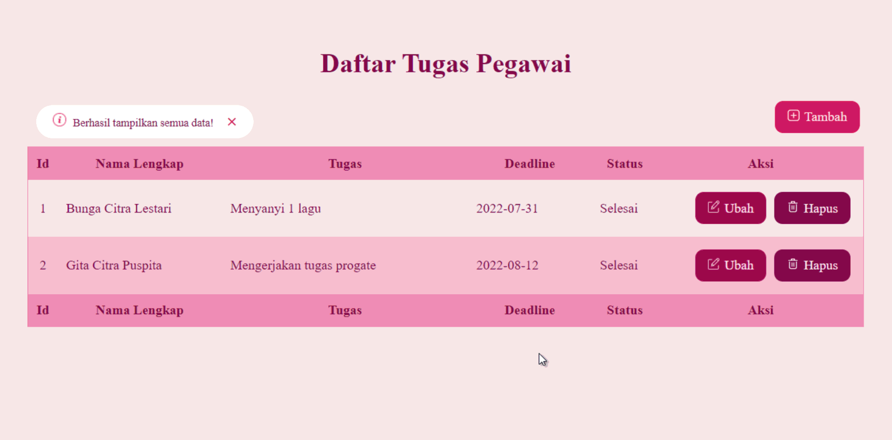

Nama Proyek: Mini Project Golang  
Pembuat: Gita Citra Puspita  
Deksripsi: Tugas ini dibuat untuk memenuhi kewajiban dalam mengikuti pelatihan PROA Digitalent Kelas Golang

# Struktur Proyek

### asset

Folder ini berisi folder style css dan images.

### database

Folder ini berisi database

### template

Folder ini berisi file format html.

### go.mod

Environment modul yang digunakan pada project golang ini.

### go.sum

Summary modul yang digunakan pada projek golang ini.

### main.go

File utama program golang berisi fungsi tampilkan semua data, tampilkan data berdasarkan id yg dipilih, tambah data, edit data, hapus data, kontroler, router http, dan fungsi utama.

# Cara menjalankan project

1. Install XAMPP.
2. Install Golang
3. Clone project ini.
4. Masukan database task_pegawai yang ada pada folder database ke dalam database mysql.
5. Masuk dalam folder project melalui terminal.
6. Install modul github.com/go-sql-driver/mysql
7. Pada file main.go pastikan pada fungsi koneksi username, port, dan database yang anda masukan benar.
8. Jalankan dengan perintah go run main.go.
9. Akses localhost port 8080.
10. Selesai

# Demo Aplikasi

